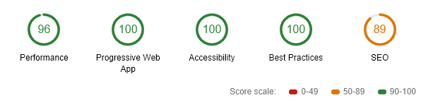

# RSS Feed Reader
[Live Demo](https://rss-feed-reader-5x323wcy2.now.sh/)

This project was generated with [Angular CLI](https://github.com/angular/angular-cli) version 7.2.6.
Application meets PWA standards (includes service workers...):

## Development server

Run `ng serve` for a dev server. Navigate to `http://localhost:4200/`. The app will automatically reload if you change any of the source files.

## Production build - Testing PWA
Run `ng build --prod` then go to /dist/rss-feed-reader and run `ng serve` to be able to test PWA functionality. Navigate to `http://localhost:4200/`.

## Code scaffolding

Run `ng generate component component-name` to generate a new component. You can also use `ng generate directive|pipe|service|class|guard|interface|enum|module`.

## Build

Run `ng build` to build the project. The build artifacts will be stored in the `dist/` directory. Use the `--prod` flag for a production build.

## Further help

To get more help on the Angular CLI use `ng help` or go check out the [Angular CLI README](https://github.com/angular/angular-cli/blob/master/README.md).
